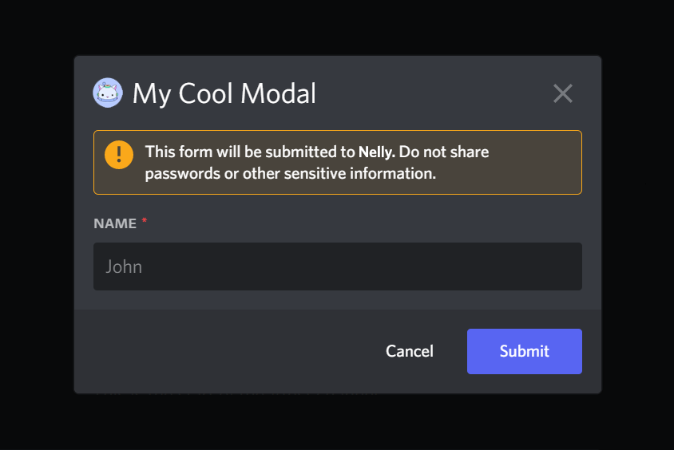

# Modals

<figure markdown>
  { width="650" }
  <figcaption>A Modal in action</figcaption>
</figure>

With the release of miru v2.0.0, **modals** are now available to use. They function in a very similar way to
views, with a few notable exceptions, namely:

- Modals are sent using builder objects.

- Modal items do not have individual callbacks, instead the entire modal has one singular callback.

- Modals only accept [`ModalItem`][miru.abc.item.ModalItem], and pass [`ModalContext`][miru.context.modal.ModalContext] when the callback is triggered.


!!! note
    Please note that modals can only be sent as an initial response to an **interaction**.

Let's create our first modal:


```py
class MyModal(miru.Modal):

    name = miru.TextInput(
        label="Name",
        placeholder="Type your name!",
        required=True
    )

    bio = miru.TextInput(
        label="Biography",
        value="Pre-filled content!",
        style=hikari.TextInputStyle.PARAGRAPH
    )

    # The callback function is called after the user hits 'Submit'
    async def callback(self, ctx: miru.ModalContext) -> None:
        # You can also access the values using ctx.values,
        # Modal.values, or use ctx.get_value_by_id()
        await ctx.respond(
            f"Your name: `{self.name.value}`\nYour bio: ```{self.bio.value}```"
        )
```


There is also an alternative way to add items to a modal, through the [`Modal.add_item`][miru.modal.Modal.add_item] method, similarly to views.

!!! warning
    Please be careful when naming your modal item variables. They cannot shadow existing modal properties such as **title** or **custom_id**.

Now, we will generate an **interaction** through the use of a button so we can send the user our modal:

```py
class ModalView(miru.View):
    # Create a new button that will invoke our modal
    @miru.button(label="Click me!", style=hikari.ButtonStyle.PRIMARY)
    async def modal_button(self, ctx: miru.ViewContext, button: miru.Button) -> None:
        modal = MyModal(title="Example Title")
        await ctx.respond_with_modal(modal)
```

Combining the above code with the modal we created earlier, you should now have a basic working example where the user can click the button,
get prompted with a modal, and then submit their input. For more information on modals, please see the [`Modal`][miru.modal.Modal] API reference.

If you want to use modals in slash commands, you need to turn it into a builder, then send it as a response to the relevant interaction:

=== "arc"

    ```py
    @arc_client.include
    @arc.slash_command("name", "description")
    async def some_slash_command(ctx: arc.Context[arc.GatewayClient]) -> None:
        modal = MyModal(title="Example Title")

        builder = modal.build_response(client)
        # arc has a built-in way to respond with a builder
        await ctx.respond_with_builder(builder)

        client.start_modal(modal)
    ```

=== "crescent"

    Crescent does not currently support modals.
    <!---
    ```py
    @crescent_client.include
    @crescent.command("name", "description")
    class SomeSlashCommand:
        async def callback(self, ctx: crescent.Context) -> None:
            modal = MyModal(title="Example Title")

            builder = modal.build_response(client)
            # Add modal func from crescent when exists
            client.start_modal(modal)
    ```
    --->

=== "lightbulb"

    ```py
    @lightbulb_bot.command()
    @lightbulb.command("name", "description", auto_defer=False)
    @lightbulb.implements(lightbulb.SlashCommand)
    async def some_slash_command(ctx: lightbulb.SlashContext) -> None:
        modal = MyModal(title="Example Title")

        builder = modal.build_response(client)
        await builder.create_modal_response(ctx.interaction)

        client.start_modal(modal)
    ```

=== "tanjun"

    ```py
    @tanjun.as_slash_command("name", "description")
    async def some_slash_command(ctx: tanjun.abc.SlashContext) -> None:
        modal = MyModal(title="Example Title")

        builder = modal.build_response(client)
        # the builder has specific adapters for tanjun
        await ctx.create_modal_response(
            *builder.to_tanjun_args(),
            **builder.to_tanjun_kwargs()
        )

        client.start_modal(modal)
    ```
