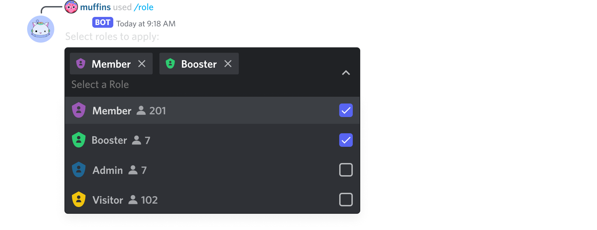

# Selects

<figure markdown>
  { width="800" }
  <figcaption>A Role Select</figcaption>
</figure>


One of the most versatile message components provided by Discord are select menus. Users can select from channels, roles, users, or even custom options you provided!
To get started, you first need to decide which type of select menu would best suit your needs.

- [`miru.TextSelect`][miru.select.text.TextSelect] and it's decorator [`@miru.text_select`][miru.select.text.text_select] - for creating selects with custom options
- [`miru.UserSelect`][miru.select.user.UserSelect] and it's decorator [`@miru.user_select`][miru.select.user.user_select] - for selecting Discord users of a server
- [`miru.ChannelSelect`][miru.select.channel.ChannelSelect] and it's decorator [`@miru.channel_select`][miru.select.channel.channel_select] - for selecting specific channels
- [`miru.RoleSelect`][miru.select.role.RoleSelect] and it's decorator [`@miru.role_select`][miru.select.role.role_select] - for selecting roles of a given server
- [`miru.MentionableSelect`][miru.select.mentionable.MentionableSelect] and it's decorator [`@miru.mentionable_select`][miru.select.mentionable.mentionable_select] - for selecting any mentionable Discord object

To add a select menu to your view, you can use the decorator, or call the [`.add_item()`][miru.view.View.add_item] method on a view and pass an instance of a select, similarly to buttons and other items.

Here's a short example showcasing how select menus work with the decorator syntax:


```py
import hikari
import miru

class SelectView(miru.View):

    @miru.text_select(
        placeholder="Select me!",
        options=[
            miru.SelectOption(label="Option 1"),
            miru.SelectOption(label="Option 2"),
        ],
    )
    async def get_text(
        self, select: miru.TextSelect, ctx: miru.ViewContext
    ) -> None:
        await ctx.respond(f"You've chosen {select.values[0]}!")

    @miru.user_select(placeholder="Select a user!")
    async def get_users(
        self, select: miru.UserSelect, ctx: miru.ViewContext
    ) -> None:
        await ctx.respond(f"You've chosen {select.values[0].mention}!")

    # We can control how many options should be selected
    @miru.role_select(placeholder="Select 3-5 roles!", min_values=3, max_values=5)
    async def get_roles(
        self, select: miru.RoleSelect, ctx: miru.ViewContext
    ) -> None:
        await ctx.respond(
            f"You've chosen {' '.join([r.mention for r in select.values])}!"
        )

    # A select where the user can only select text and announcement channels
    @miru.channel_select(
        placeholder="Select a text channel!",
        channel_types=[
            hikari.ChannelType.GUILD_TEXT,
            hikari.ChannelType.GUILD_NEWS
        ],
    )
    async def get_channels(
        self, select: miru.ChannelSelect, ctx: miru.ViewContext
    ) -> None:
        await ctx.respond(f"You've chosen {select.values[0].mention}!")
```


!!! note
    Select menus take up an entire row of a view, meaning that there can be a maximum of 5 per given message.
